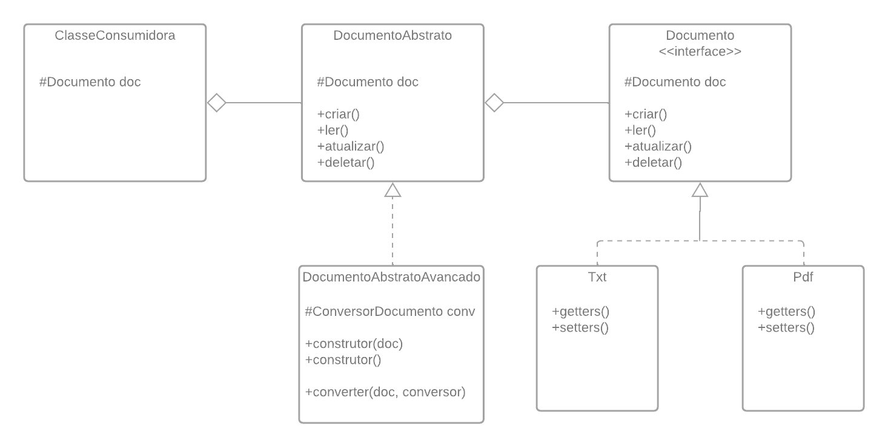

Bridge Pattern. 

 

O padrão bridge é um padrão estrutural que, a partir de interfaces, permite a utilização das implementações concretas encapsuladas nas abstrações e a troca destas implementações em tempo de execução, diminuindo o acoplamento entre as classes e aumentando a coesão do código, visto que a mesma abstração de uma classe concreta pode ser usada em diversos cenários sem a necessidade de reescrever o código, fazendo o uso do encapsulamento que dependendo do tipo de parâmetro passado no seu construtor se comportará como a implementação concreta desta abstração. Vale lembrar que abstração neste exemplo não tem relação direta com a definição de classe abstrata do Java, sendo assim, esta abstração poderá ser implementada conforme as especificidades de cada linguagem. 

 

Um exemplo de uso é a necessidade de criar um documento no lado do cliente.  

Não seria interessante criar uma instância de cada tipo de documento para usar apenas um por vez e nem criar todos os tipos possíveis de documentos que o cliente poderá usar, então o ideal seria criar uma abstração que encapsula um documento do tipo solicitado e a partir deste documento executar as funções que ele permite executar. 

Figura 01 – Diagrama de classes 

 

Interface (DocumentoAbstrato) – No diagrama de classes é possível ver que existe uma classe concreta chamada DocumentoAbstrato e esta contém uma instância protegida de Documento, que é uma interface, porém, neste contexto a interface é a própria classe DocumentoAbstrato que interagirá com o cliente. 

 

Interface (DocumentoAbstratoAvancado) - Esta classe também é uma interface, porém com novos recursos, encapsulando nela um outro tipo que permitirá manipular o objeto encapsulado na classe pai. Este outro objeto também está sendo acessado por uma ponta (bridge) que fornecerá o objeto solicitado e permitirá novas funcionalidades no sistema a partir das implementações disponíveis. 

 

Plataforma (Txt, Pdf) – Plataforma são as classes que contém a lógica do objeto em questão. Estas classes podem alterar o comportamento dos métodos definidos na interface sem afetar o cliente consumidor, pois este está totalmente desacoplado da implementação como prevê o padrão bridge. 

 

Implementação (Documento) – A interface Documento é a ponte entre a plataforma e a abstração. É chamada de implementação por ser o contrato que as implementações concretas devem obedecer para serem consideradas “filhas” desta interface. Os objetos que forem passados para as abstrações (DocumentoAbstrato ou DocumentoAbstratoAvancado) poderão ser trocados em tempo de execução sem que existam erros. 

 

Vale lembrar que este padrão é estrutural e fica a cargo do cliente consumidor instanciar um objeto do tipo desejado, sendo assim, um novo design pattern criacional pode ser usado para criar a lógica de instâncias dos objetos necessários no lado cliente, isolando ainda mais as regras de criação de objetos do cliente consumidor 
